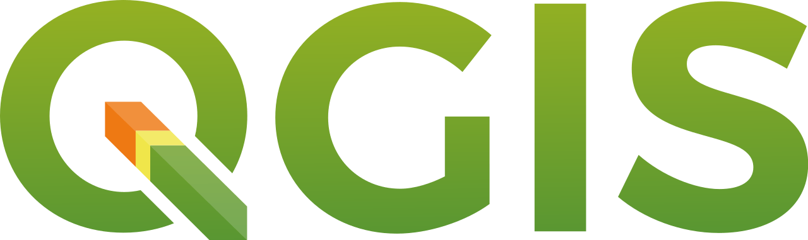

In the practicals and on this website we will be using only software which is free and open-source, meaning it is available for anyone to download and use free of charge.

## QGIS

In the practicals for ENVS255 we have been using QGIS, which is available to download at [here.](https://qgis.org/download/) QGIS is a free and open-source Geographic Information System (GIS) application designed for spatial data visualisation, analysis, and management. It is widely used in research and industry for creating, editing, and analysing geospatial data.

Alongside what we worked on in the taught practicals, there is a plethora of excellent resources for learning how to best use QGIS available online - some of these are listed in the [Tutorials](https://e-honan.github.io/GIS-Resources/Tutorials.html) tab of this website.

## R and RStudio 

One of the most frequently used softwares for animal movement studies is R and RStudio.

